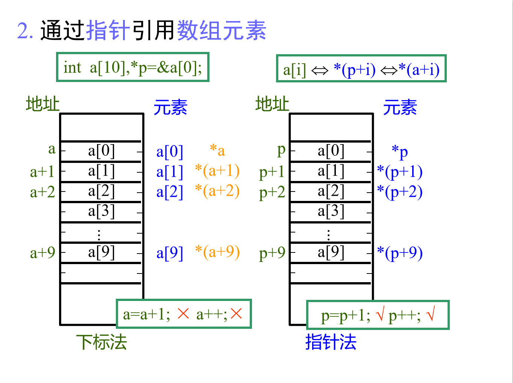

---
export_on_save:
  html: true
html:
  embed_local_images: false
  embed_svg: true
  offline: false
  toc: true

print_background: false
---

###有意思的指针
+ 定义一个16大小的数组(空间)，用指针的方式自增放入8bit数据时，会以0-8-16的方式放入a[0]，以0-8-16的方式在放入a[1]，因为数组是连续的空间，a[0]，a[1]只是做了个门牌标识，并不会影响空间，指针在识别首地址后，按照自增的宽度，写入数据。
+ 注意大小端之间数据的前后顺序问题
+ 
+ [知乎网址](https://zhuanlan.zhihu.com/p/316347205?utm_id=0)

###数组的实质 
####[]--地址偏移运算符
在C语言中，一维数组的任何一个元素的地址，都可以用其数组名加上一个偏移量来表示。 
    即 &a[i] --- a+i
 *&a[i] --- a[i] --- *(a+i)
####应用数组元素的方法
+ int a[5],*p,temp; 
  p=a;
  1. temp=a[2];
  2. temp=p+2;
  3. temp=a+2;
  4. temp=p[2];
+ a=a+2不合法，a是地址常量，不可更改
+ 但把常量a的地址赋给变量p，可以进行地址的更改
  + 因为常量不可更改---》出现了变量
  + 因为地址常量不可更改---》出现了地址变量(指针)

```c
void main()
{	
    int i, a[10];
	cout<< "index,  Address, size:\n" ;
	for( i = 0; i < 5; i++ )
    cout<< " &a[" <<i<< "], " <<&a[i]<<"   "<<sizeof( a[i])<<endl ;  
    cout<< "Address of a ="<<a<<endl;
    cout<< "size of a ="<<sizeof(a)<<endl;
}

程序运行结果如下(VC)：
 index,  Address, size:
&a[ 0 ], 0x12ff54, 4
&a[ 1 ], 0x12ff58, 4
&a[ 2 ], 0x12ff5c, 4
&a[ 3 ], 0x12ff60, 4
&a[ 4 ], 0x12ff64, 4
Address  of   a = 0x12ff54 //与 内容a[0] 的地址相同
size  of a = 20

```
###二维数组与两层指针


###动态指针
```c++
#include<iostream>
#include<stdlib.h>
using namespace std;

int main()
{	

	int  student=0;
	int  number=0;
	int  course=0;
	int amount_course=0;
	int amount_student=0;
	float average=0;
	cout<<"enter the amount of students and courses";
	cin>>amount_student;
	cin>>amount_course;
	student=(int)calloc(amount_student,amount_course4);   4   -- sizeof(int)
	course=(int)calloc(amount_course,4);

	for(int i=0;iamount_student;i++)
	{
		if((student!=NULL)&&(course!=NULL))
		{	
			for(int i=0;iamount_student;i++)
			{
				student[i]=i;
				course=student;
			}
			cout<<"enter student's numberendl";
			cin>>number;
			cout<<enter amount_course course scores of this student;
			for(int i=0;iamount_course;i++)
			{
				cin>>course[4(number-1)+i];
			}
		}
	}
	cout<<"enter the number of students";
	cin>>number;
	cout<<"corresponding score isendl";
	for(int i=0;iamount_course;i++)
	{
		cout<<course[4(number-1)+i];
		average+=course[4(number-1)+i];
	}
	coutaverage is (averageamount_course)endl;
	free(student);	
	free(course);
	student=NULL;
	course=NULL;
	return 0;
}
```