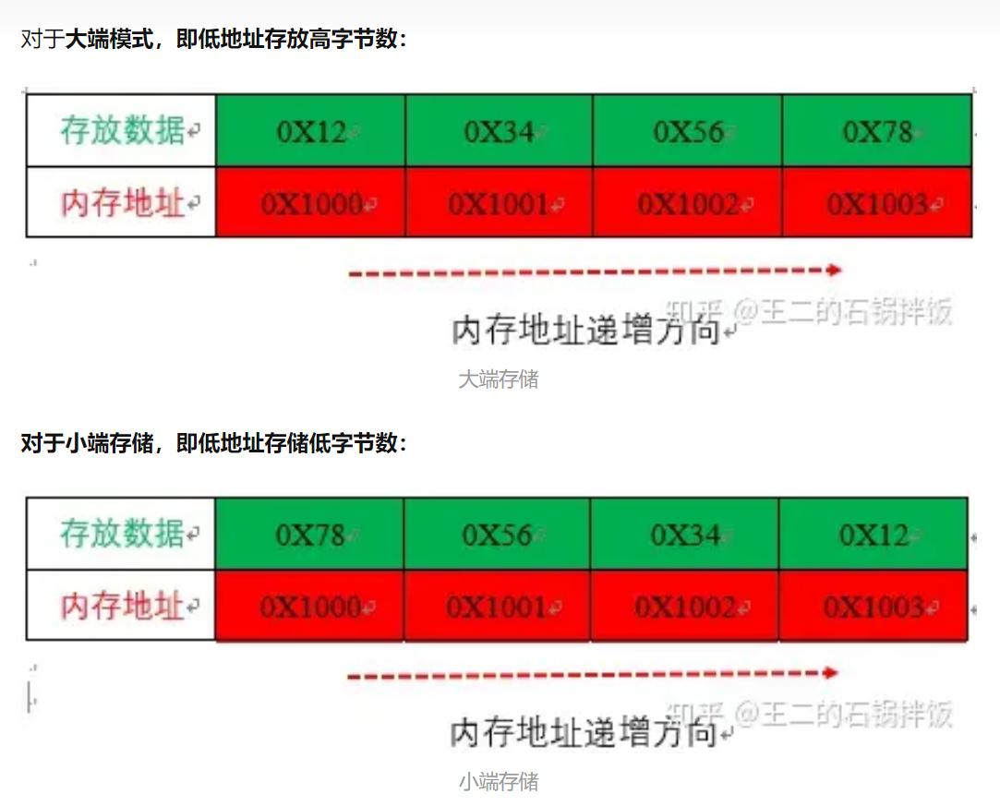

---
export_on_save:
  html: true
html:
  embed_local_images: false
  embed_svg: true
  offline: false
  toc: true

print_background: false
---


####数据大小 strlen( ) ； sizeof( )；
+ 区别：
strlen的大小比sizeof小一个   
sizeof是字符串在内存中的大小，算入了最后的'\0'
strlen是字符串本身的大小，没有加入'\0'

####数组的大小 
+ 0x00=0000 0000表示1 Byte。
char a[2] = {0xcf,0xff};  表示字符型数组a 每个元素占1个Byte  共2Byte。  
uint16_t a[32]={0};    表示无符号整形数组a  每个元素2Byte  共2*32=64Byte
uint8_t a[]="dasdasdas";   合法,byte=9+1且可以printf("%s"，a);


####数据的截断
1. 截取需要的数据
```c
uint32_t ReadAddr;
(ReadAddr & 0xFF0000) >> 16;//截取17~24位
(ReadAddr & 0xFF00) >> 8;   //截取9~16位
ReadAddr & 0xFF;            //截取低8位
```

2. 数据丢失
16位数据存为double   ， 强制转换为  uint16_t 时 ， 丢失小数，强制转换为 uint8_t 时，丢失部分整数及小数。    

####数据的存储
+ printf输出数组时，检测到\0则停止，检测到0不停止，输入的0是数据，会被存为ASCLL码，而初始内存的0，是ASCLL码的0，会产生停止。
+ 也就是要输出一串数组，在给数组赋值时，可以写入11011xx等，输出11011xx
但是若数组 a[15]存在值，但是a[0:14]不存在值，在写入时要保证写入的数据宽度为14，来连接a[15]以及后面的内容
+ 同样一段binary number，int8*，int8_t和char放在内存空间中的binary也许相同，但是由于int/char对内存空间进行了标记，读取出来的data不一样
  
####数据的收发
+ 串口助手，勾选发送新行  \r\n  会使得发的数据比原本的数据大
  
{width=80% height=auto}
[大小端讲解知乎](https://zhuanlan.zhihu.com/p/316347205?utm_id=0)