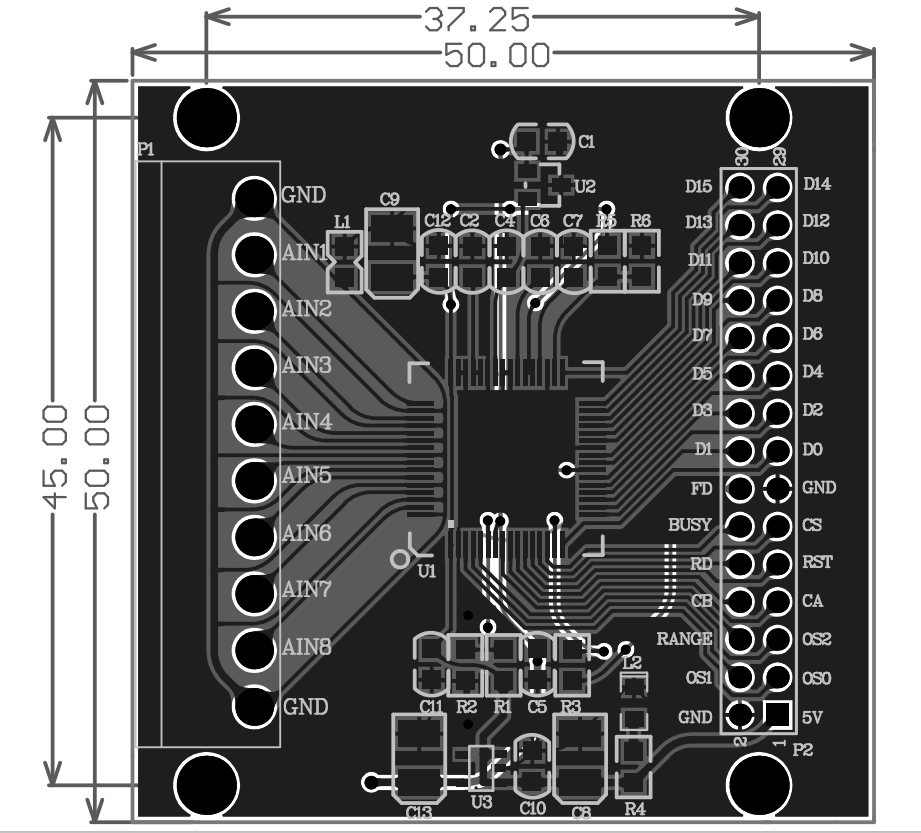
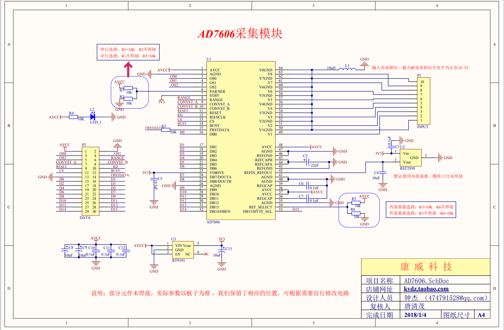

---
export_on_save:
  html: true
html:
  embed_local_images: false
  embed_svg: true
  offline: false
  toc: true

print_background: false
---
***
##dating...
{ width=100% height=auto }

{ width=100% height=auto }
```c
//传入原始数据，返回ADC数据
int16_t getADCValue(uint16_t code)
{
    return code&0x8000 ? (-((~code+1)&0x7fff)) : code;
    //若是负数，舍弃最高位，将以补码形式存在的负数变为 -正数，便于阅读
    //若是正数，直接返回
}
//传传入原始数据，转换为电压V数据
float AD7606ConvValue(uint16_t code)
{
    int _val;
    float adcValue;
    _val = code&0x8000 ? (-((~code+1)&0x7fff)) : code;
    adcValue = 5.0*_val/32768.0;
    return adcValue;
}
//传传入原始数据，转换为电压mV数据
uint32_t AD7606ConvValue1(uint16_t code)
{
    int _val;
    uint32_t adcValue;
    _val = code&0x8000 ? (-((~code+1)&0x7fff)) : code;
    adcValue = 5*1000*_val/32768;
    return adcValue;
}

```